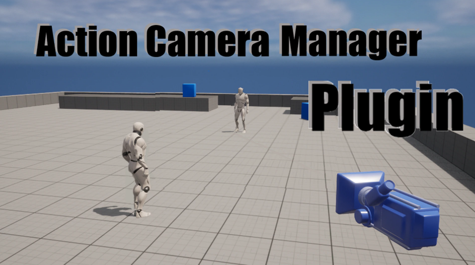

# Action Camera Manager Plugin

## About

※ This plugin is being built on Unreal Engine 4.27 ~ 5.4

__"Action Camera Manager Plugin"__ is a camera plugin that can be used for various fighting games. There are a total of three modes: __"3D mode"__ used in the same format as the Naruto Ultimate Storm, __"2D mode"__ used in the same format as the Tekken, and __"2D_Fix"__ mode used in the same format as the (old) Tekken. [The video](https://youtu.be/iWDMIVvR27I) will help you understand!

## Features

* Various camera types are available
* Replicated
* Plugin
* Increased scalability

## Istallation

 - Download the plugin [here](https://www.unrealengine.com/marketplace/ko/product/6b542e9ad0b64686b1bf31dca9276316)
 - Check Wiki!

## Links
* [Documentation](https://github.com/Goaway-1/Action-Camera-Manager-Plugin/wiki)
* [Preview video](https://youtu.be/iWDMIVvR27I)